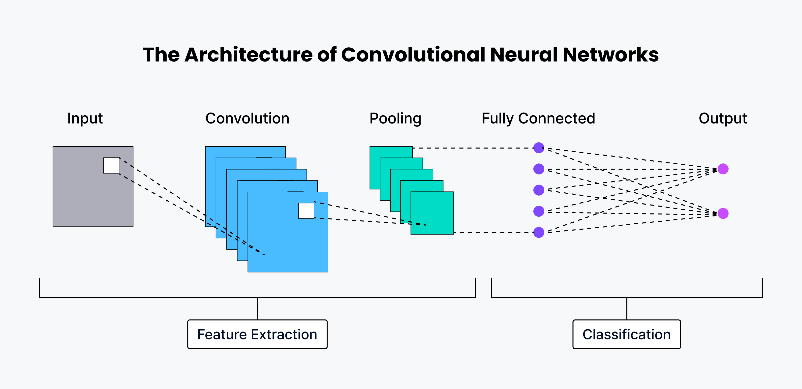
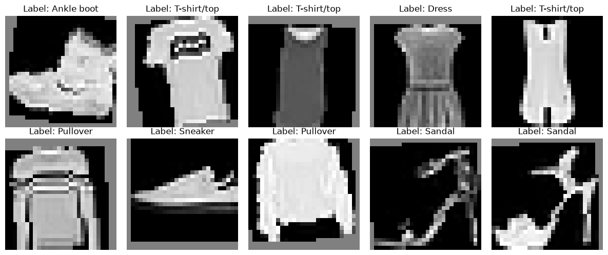
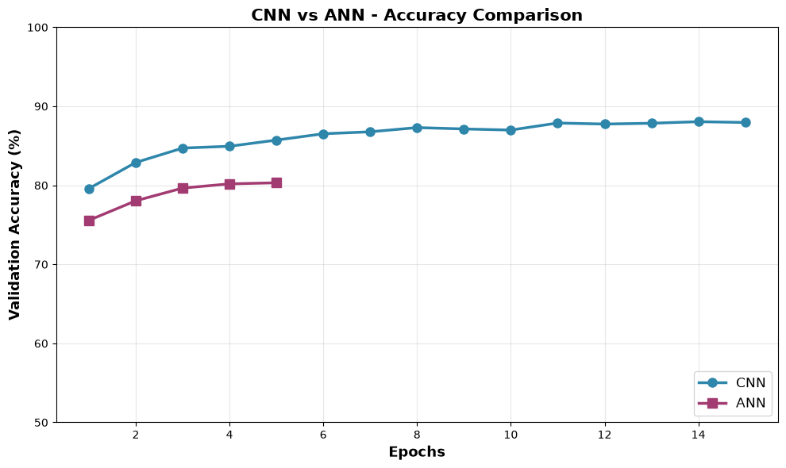
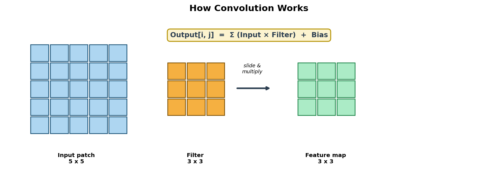
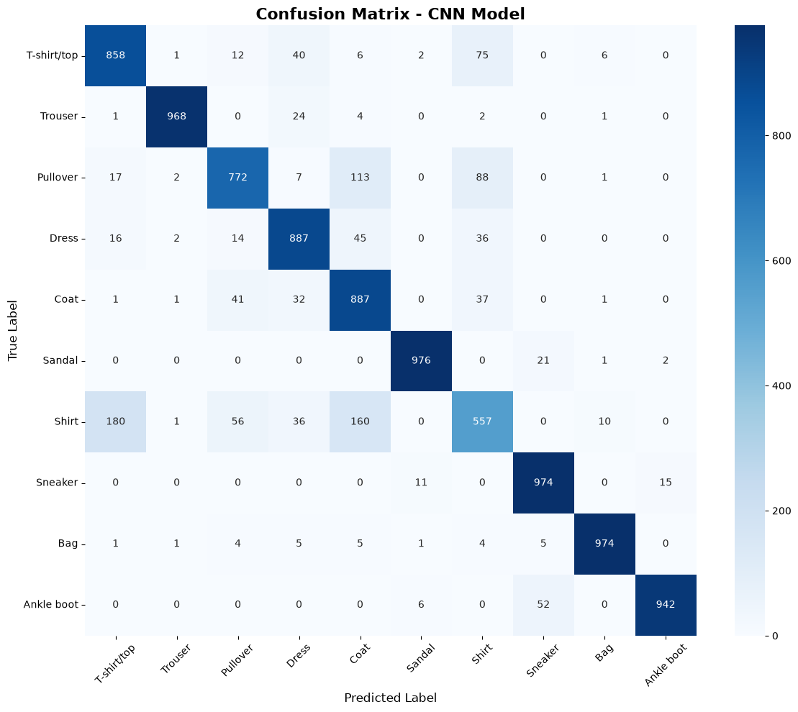
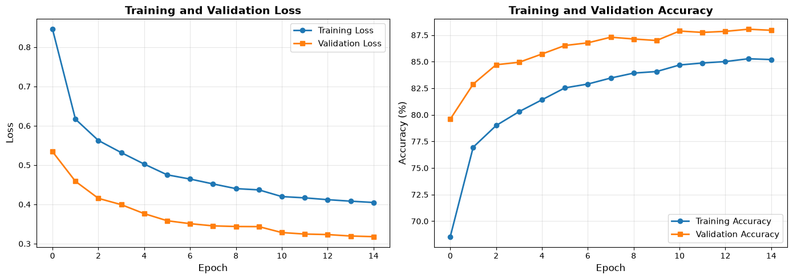

# Fashion-MNIST Classification using Convolutional Neural Networks (CNN)


**Prepared by:** Mommna

---

## Overview

This project classifies **fashion product images** from the **Fashion-MNIST** dataset using a **Convolutional Neural Network (CNN)** implemented in PyTorch. The notebook (`Fashion_MNIST_CNN_Complete_Improved.ipynb`) walks through the full pipeline: dataset loading, architecture design, mathematical foundations, training, evaluation, visualizations, and a head-to-head comparison against a traditional fully connected network (ANN).

**Key Result:** CNN achieves **87.95%** test accuracy with **206,922** parameters — outperforming a comparable ANN (80.32%) while using fewer parameters and preserving spatial structure.

---

## 1. Topic: What is a CNN?

**Definition:** A Convolutional Neural Network is a deep learning architecture designed specifically for **grid-like data** such as images.

Unlike a regular Artificial Neural Network (ANN), which treats every pixel as an independent feature, a CNN understands an image through **local patterns** (edges, textures, shapes) and builds understanding layer by layer.

### Three Core Ideas

| Idea | Meaning |
|------|---------|
| **Local Receptive Field** | Each neuron looks only at a small region (e.g. 3×3 window) |
| **Weight Sharing** | The same filter is reused across the entire image → far fewer parameters |
| **Hierarchical Features** | Learns edges → textures → object parts → full objects |

### High-Level CNN Architecture



| Part | Stages | Role |
|------|--------|------|
| **Feature Extraction** | Input → Convolution → Pooling | Detect patterns and reduce spatial size |
| **Classification** | Fully Connected → Output | Decide the final class |

---

## 2. Dataset

**Source:** [Fashion-MNIST](https://github.com/zalandoresearch/fashion-mnist) (Zalando Research)

| Property | Value |
|----------|-------|
| Total images | 70,000 grayscale |
| Training samples | 60,000 |
| Test samples | 10,000 |
| Image size | 28 × 28 × 1 |
| Classes | 10 fashion categories |
| Class balance | Perfectly balanced (6,000 train / 1,000 test per class) |

### Class Labels

| Index | Class | Index | Class |
|-------|-------|-------|-------|
| 0 | T-shirt/top | 5 | Sandal |
| 1 | Trouser | 6 | Shirt |
| 2 | Pullover | 7 | Sneaker |
| 3 | Dress | 8 | Bag |
| 4 | Coat | 9 | Ankle boot |


> **Why augmentation?** Creates slight variations of each image so the model generalizes better and overfits less.



---

## 3. Why a Plain ANN Struggles with Images

```
28 × 28 image  →  784 flat features
First dense layer (128 units)  →  784 × 128 ≈ 100,000 weights (already huge)
```

| Problem | Effect |
|---------|--------|
| No spatial structure | Nearby pixels treated as independent |
| Huge parameter count | Slow training, easy to overfit |
| No weight sharing | Same pattern must be re-learned everywhere |
| Poor scalability | Cannot handle higher-resolution images well |

CNNs fix these issues with **local connectivity** and **weight sharing**.



---

## 4. Model Architecture

```
Input (1, 28, 28)
        │
        ▼
Conv2D (1 → 16, kernel 3×3, pad=1) + ReLU
        │
        ▼
MaxPool2D (2×2)  →  (16, 14, 14)
        │
        ▼
Conv2D (16 → 32, kernel 3×3, pad=1) + ReLU
        │
        ▼
MaxPool2D (2×2)  →  (32, 7, 7)
        │
        ▼
Flatten  →  1,568 features
        │
        ▼
Linear (1568 → 128) + ReLU + Dropout(0.5)
        │
        ▼
Linear (128 → 10)   ← logits
        │
        ▼
Softmax (inside CrossEntropyLoss)
```


---

## 5. Mathematical Foundations

### Convolution

$$
\text{Output}[i, j] = \sum_m \sum_n \text{Input}[i+m,\ j+n] \times \text{Filter}[m, n] + \text{Bias}
$$



### Output size after convolution

$$
H_{out} = \left\lfloor \frac{H_{in} + 2p - k}{s} \right\rfloor + 1
$$

- $k$ = kernel size, $p$ = padding, $s$ = stride  
- With $k=3$, $p=1$, $s=1$ → spatial size is preserved before pooling

### ReLU Activation

$$
\text{ReLU}(x) = \max(0,\ x)
$$

### Softmax (class probabilities)

$$
P(i) = \frac{e^{z_i}}{\sum_j e^{z_j}}
$$

### Cross-Entropy Loss

$$
L = -\sum_i y_i \log P(i)
$$

---

## 6. Training Configuration

| Component | Choice | Reason |
|-----------|--------|--------|
| Loss | `CrossEntropyLoss` | Standard for multi-class classification |
| Optimizer | Adam (lr = 0.001) | Adaptive learning rates, fast convergence |
| Scheduler | StepLR (step=5, γ=0.5) | Halve LR every 5 epochs |
| Batch size | 128 | Balance of speed and stability |
| Epochs | 15 | Sufficient for this dataset size |
| Device | CPU (PyTorch 2.5.1) | — |

---

## 7. Model Evaluation

### Overall Metrics (Test Set — 10,000 images)

| Metric | Score |
|--------|-------|
| **Accuracy** | **87.95%** |
| Precision (weighted) | 88.02% |
| Recall (weighted) | 87.95% |
| F1-Score (weighted) | 87.78% |

### Per-Class Accuracy

| Class | Accuracy | Class | Accuracy |
|-------|----------|-------|----------|
| T-shirt/top | 85.80% | Sandal | 97.60% |
| Trouser | 96.80% | Shirt | 55.70% |
| Pullover | 77.20% | Sneaker | 97.40% |
| Dress | 88.70% | Bag | 97.40% |
| Coat | 88.70% | Ankle boot | 94.20% |

> **Hardest class:** Shirt (55.70%) — frequently confused with T-shirt/top and Pullover.  
> **Easiest classes:** Sandal, Sneaker, Bag (~97%).

### Confusion Matrix



### Training Curves



---

## 8. CNN vs ANN Comparison

A simple fully connected network was trained on the **same data** for a fair comparison.


**Takeaway:** CNN is ~1.1× more parameter-efficient and ~8 percentage points more accurate, because convolutions preserve spatial structure and share weights across the image.

---

## 9. Key Findings

1. **CNNs preserve spatial structure** — they look at local neighborhoods instead of treating pixels independently.
2. **Weight sharing** cuts the parameter count and enables translation invariance.
3. **Hierarchical feature learning** (edges → textures → parts) is what makes CNNs powerful for vision.
4. **Pooling** provides translation tolerance and reduces computation.
5. Even a relatively small CNN clearly beats a comparable dense network on image data.
6. Shirt vs T-shirt/top remains the hardest pair — a known challenge on Fashion-MNIST.


## References

- Xiao, H., Rasul, K., & Vollgraf, R. (2017). *Fashion-MNIST: a Novel Image Dataset for Benchmarking Machine Learning Algorithms.* [arXiv:1708.07747](https://arxiv.org/abs/1708.07747)
- LeCun, Y., et al. (1998). *Gradient-Based Learning Applied to Document Recognition* (LeNet)
- Krizhevsky, A., et al. (2012). *ImageNet Classification with Deep Convolutional Neural Networks* (AlexNet)
- Simonyan, K., & Zisserman, A. (2014). *Very Deep Convolutional Networks for Large-Scale Image Recognition* (VGG)
- He, K., et al. (2015). *Deep Residual Learning for Image Recognition* (ResNet)
